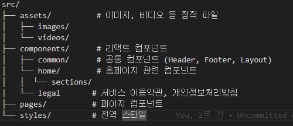

# CEEP 랜딩 페이지

CEEP의 서비스 및 회사 소개를 위한 랜딩 페이지입니다.

## 기술 스택

- **React**: 사용자 인터페이스 구축을 위한 JavaScript 라이브러리
- **Vite**: 빠른 개발 환경을 제공하는 빌드 도구
- **Tailwind CSS**: 유틸리티 기반의 CSS 프레임워크
- **Framer Motion**: 애니메이션을 쉽게 구현할 수 있는 라이브러리
- **React Router DOM**: SPA(Single Page Application)에서 페이지 라우팅을 위한 라이브러리

## 종속성 설치
```bash
npm install
```

## 개발 서버 실행
### 1. 개발 서버 시작
```bash
npm run dev
```

### 2. 브라우저에서 확인
- http://localhost:5173 접속
- 다른 디바이스에서 접속하려면:
```bash
npm run dev -- --host
```

## 프로젝트 구조



## 주요 기능
- **반응형 디자인**: 모바일, 태블릿, 데스크톱에 최적화된 디자인
- **스크롤 기반 애니메이션**: 스크롤에 따라 동적으로 변화하는 애니메이션
- **페이지 라우팅**: React Router를 이용한 페이지 간 이동